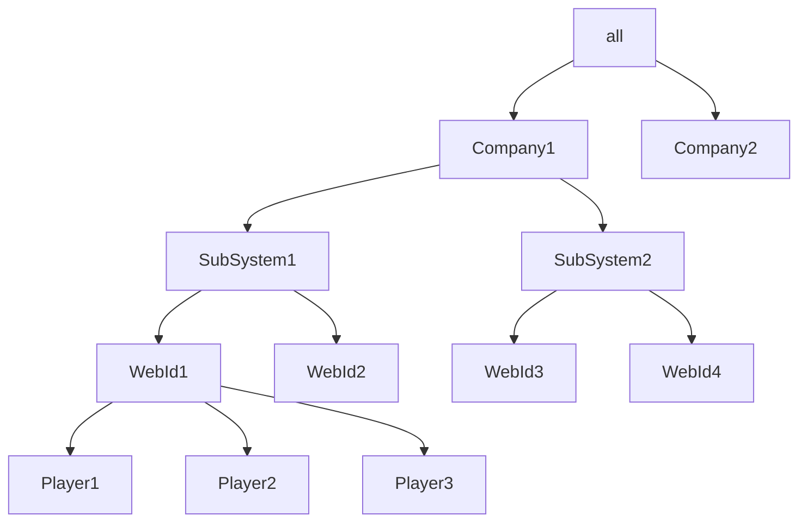

# Data Struct

## Tree Data
- 10 Company
- 1 Company per 15 SubSystem, total 150
- 1 SubSystem per 20 WebId, total 3,000
- 1 WebId per 10 player, total 30,000

## Record Data
1 player per 20 records, total 600,000